# Workflow before / after — GƯƠNG (AI chấm kỹ thuật tập gym)


> File nộp kèm cho Phase 5. Bản đầy đủ kèm bảng actor/input/output và Problem Statement v0 nằm ở [group-report.md](group-report.md).


**Actor:** người tập gym chưa từng được ai sửa form trực tiếp (thường 0-6 tháng đầu), tự tập, không đủ ngân sách thuê PT 1-1.


**Phạm vi:** 3 bài compound — squat, deadlift, bench press. *Overhead press đã bị loại ở Phase 4* vì shoulder flexion nằm đúng nhóm góc mà nghiên cứu đo kém nhất (sai số vượt 10°).


---


## CURRENT STATE


```text
~12' chết/buổi (N=1, CHƯA VERIFY) · độ trễ phát hiện sai form: 2-3 TUẦN


[1 Xem note lịch tập: 1']
→ [2 Mở YouTube xem lại form bài lạ: 3'/bài, ~2 bài/buổi]
→ [3 Vào set: tập + tự đếm rep trong đầu]        <-- mất đếm khi mệt
→ [4 Dựng điện thoại quay clip: 2']              <-- handoff người↔người DUY NHẤT
                                                     và là bước hay bị bỏ nhất (ngại nhờ)
→ [5 Tua clip tự soi form: 4']                   <-- BOTTLENECK
                                                     có clip nhưng KHÔNG CÓ CHUẨN đối chiếu
                                                     → 4' đổi lấy một phán đoán không đáng tin
→ [6 Ghi tay kg/set/rep vào note: 2']            <-- ~40% set bị quên ghi
→ [7 Cuối tuần nhìn note quyết tăng tạ: 5'/tuần] <-- quyết định trên dữ liệu khuyết


Vòng lặp hỏng: bước 6 khuyết → bước 1 và bước 7 tuần sau chạy trên dữ liệu thiếu.
Hậu quả thật: sai form tuần 1 → tuần 3 mới biết, khi cơ thể đã báo bằng cơn đau.
```


---


## FUTURE STATE


```text
dưới 4' chết/buổi · feedback NGAY TRONG SET


[0 Kiểm chất lượng khung hình: 30"]              -- RULE (đủ sáng? đủ khớp trong khung? đúng cự ly?)
     └─ KHÔNG ĐẠT → "Không thấy rõ khớp gối — xoay điện thoại ngang, lùi ra 2m"
                    → dừng chấm form, VẪN đếm rep + log
→ [1 Người tập chọn 1 trong 3 bài: 10"]          -- NGƯỜI
→ [2 Pose estimation → góc khớp: real-time]      -- AI  (MediaPipe, on-device, video không rời máy)
→ [3 So ngưỡng, mọi ngưỡng ≥ 6°: real-time]      -- RULE (ngưỡng do HLV có chứng chỉ duyệt)
→ [4 Cảnh báo giọng nói trong set]               -- RULE phát câu TEMPLATE do HLV soạn
→ [5 Đếm rep + auto-log: real-time]              -- AI
→ [6 Sau buổi: xem lại 3 rep bị flag: 2']        <-- HUMAN BOUNDARY
→ [7 Bấm "cảnh báo này sai" nếu máy sai: 10"]    -- NGƯỜI → dữ liệu đo false positive
→ [8 Tự quyết tuần sau tăng tạ hay giữ: 1']      -- NGƯỜI


AI chỉ làm ĐÚNG MỘT VIỆC: biến pixel thành góc khớp.
"Góc này đúng hay sai" là RULE. Câu cảnh báo là TEMPLATE người soạn.
```


### Ba trạng thái hiển thị — chống background error


```text
🟢 "Đang theo dõi — chưa thấy lỗi"      (viền xanh)
🟡 "KHÔNG theo dõi được" + lý do + cách sửa   (viền vàng)
🔴 "Gối đang chụm vào trong"            (viền đỏ, câu template)


🟢 và 🟡 TUYỆT ĐỐI không được trông giống nhau.
Nếu giống, người tập hiểu sự im lặng của máy thành "mình đang tập đúng"
— đúng định nghĩa background error trong PAIR Guidebook, và là kịch bản tệ nhất
của sản phẩm này.
```


### Fallback — thang 4 nấc


```text
Nấc 1  Khung hình không đạt
       → tắt chấm form, GIỮ đếm rep + log, nói rõ lý do và cách sửa (không im lặng)


Nấc 2  Người tập bấm "cảnh báo này sai" ≥3 lần/buổi cho cùng một bài
       → tự tắt cảnh báo bài đó: "Ngưỡng có vẻ chưa hợp với bạn"
       (máy tự nhận sai còn hơn để người tập tắt cả app rồi không mở lại)


Nấc 3  Bài chưa có HLV duyệt ngưỡng
       → KHÔNG phát cảnh báo form, chỉ đếm rep. Không ngoại lệ


Nấc 4  Luôn bật, không phụ thuộc AI phát hiện được gì:
       "Đau bất thường thì dừng và đi gặp người thật (HLV/bác sĩ)"
```


---


## Sơ đồ

```mermaid
flowchart TB
  subgraph CURRENT["CURRENT — độ trễ feedback 2-3 tuần"]
    A1[1 Xem note lịch tập] --> A2[2 Mở YouTube xem form]
    A2 --> A3[3 Tập + tự đếm rep]
    A3 --> A4["4 Quay clip<br/>handoff người-người duy nhất<br/>hay bị bỏ vì ngại"]
    A4 --> A5["5 Tua clip tự soi form<br/>BOTTLENECK — tốn 4' nhưng<br/>không tạo output dùng được"]
    A5 --> A6["6 Ghi tay vào note<br/>40% set bị quên"]
    A6 --> A7[7 Cuối tuần quyết tăng tạ]
    A6 -.->|dữ liệu khuyết| A1
  end


  subgraph FUTURE["FUTURE — feedback ngay trong set, 3 bài compound"]
    B0["0 Kiểm chất lượng khung hình<br/>(RULE)"] --> B1[1 Người tập chọn bài]
    B0 -.->|"không đạt → nói rõ lý do + cách sửa"| BF["Nấc 1: tắt chấm form<br/>GIỮ đếm rep + log"]
    B1 --> B2["2 Pose estimation → góc khớp<br/>(AI — on-device)"]
    B2 --> B3["3 So ngưỡng ≥ 6°<br/>(RULE — HLV duyệt)"]
    B3 --> B4["4 Cảnh báo giọng nói<br/>(TEMPLATE do HLV soạn)"]
    B2 --> B5["5 Đếm rep + auto-log<br/>(AI)"]
    B4 --> B6["6 Người tập review 3 rep bị flag<br/>HUMAN BOUNDARY"]
    B5 --> B6
    B6 --> B7["7 Bấm 'cảnh báo này sai'<br/>→ dữ liệu đo false positive"]
    B7 --> B8[8 Người tập tự quyết tăng tạ]
    B7 -.->|"≥3 lần/buổi"| BF2["Nấc 2: tự tắt cảnh báo bài đó"]
  end
```





---


## Before / after impact


| Metric | Trước | Sau kỳ vọng | Ghi chú |
|---|---:|---:|---|
| **Độ trễ phát hiện sai form** | 2-3 tuần | Ngay trong set | **Metric chính** — thay đổi về chất |
| Số bước | 7 | 9 | **Tăng.** Giá trị không nằm ở việc bớt bước |
| Số bước người phải tự làm | 7/7 | 3/9 | Chọn bài · review rep flag · quyết tăng tạ |
| Thời gian "chết"/buổi | ~12' *(N=1, chưa verify)* | Dưới 4' | Phải thay bằng trung vị ≥5 người trước khi lên PS v1 |
| Tỷ lệ set có log | ~60% | 100% | **Không tính là giá trị AI** — Hevy đã giải phần này |
| Bottleneck chính | Bước 5 soi clip không có chuẩn | Bước 6 review 3 rep bị flag | Bottleneck mới là điểm kiểm soát, chấp nhận được |
| Risk mới | Không có | (1) false positive lúc đang gồng tạ nặng; (2) background error — im lặng bị hiểu thành "đang ổn"; (3) ngưỡng sai thì sai hàng loạt | Thang fallback 1-4 nhắm đúng ba rủi ro này |


---


*Day 02 Lab — 02 Group Problem Statement — Phase 5 Workflow*
